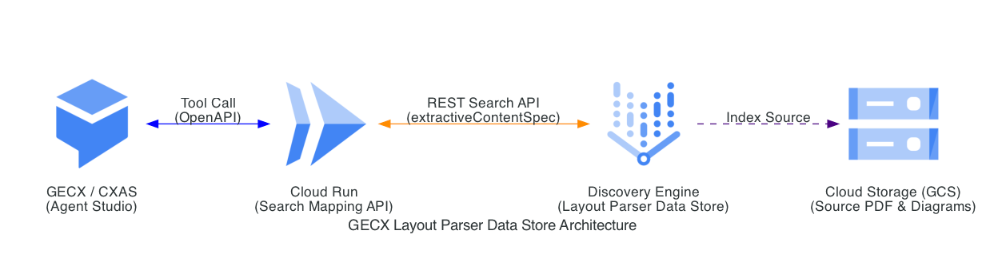

# CXAS Data Store Layout Parser 데이터 스토어 연동 문제 및 Cloud Run 우회 배포 가이드

본 가이드는 **CXAS (CX Agent Studio / Vertex AI Conversation)**에서 **Layout Parser 형식의 unstructured 데이터 스토어(layout-parser)**를 연동할 때 발생하는 빈 검색 결과(`response: {}`) 문제를 해결하고, 고객사 GCP 리소스에 **Cloud Run 기반 프록시 API**를 손쉽게 배포·테스트·연동할 수 있는 엔드투엔드 절차를 제공합니다.

---

## 📌 목차
1. [개요 및 문제 원인 (Root Cause)](#1-개요-및-문제-원인-root-cause)
2. [아키텍처 개요](#2-아키텍처-개요)
3. [🚀 Claude Code를 활용한 빠른 배포 (추천)](#3--claude-code를-활용한-빠른-배포-추천)
4. [🛠️ 단계별 상세 배포 가이드](#4-️-단계별-상세-배포-가이드)
   - [0단계: 개발 환경 및 GCP 콘솔 로그인](#0단계-개발-환경-및-gcp-콘솔-로그인)
   - [1단계: 환경 설정 및 사전 점검](#1단계-환경-설정-및-사전-점검)
   - [2단계: Cloud Run 배포 및 IAM 권한 자동 설정](#2단계-cloud-run-배포-및-iam-권한-자동-설정)
   - [3단계: 자체 단위 테스트 및 배포 후 라이브 검증](#3단계-자체-단위-테스트-및-배포-후-라이브-검증)
   - [4단계: CXAS OpenAPI 툴 등록](#4단계-cxas-openapi-툴-등록)
   - [5단계: CXAS 에이전트 인스트럭션 수정](#5단계-cxas-에이전트-인스트럭션-수정)
5. [🧹 배포 리소스 현황 점검 및 정리/삭제](#6--배포-리소스-현황-점검-및-정리삭제-management--cleanup)
6. [❓ 문제 해결 (Troubleshooting)](#7--문제-해결-troubleshooting)
7. [📚 부록: 크로스 프로젝트 연동 참고자료](#-부록-appendix-서로-다른-프로젝트-간cross-project-연동-참고자료)

---

## 1. 개요 및 문제 원인 (Root Cause)

CXAS 기본 **Data Store Tool**을 사용하여 Layout Parser 데이터스토어를 조회하면, 실제 문서가 정상 색인되어 있음에도 빈 응답(`{}`)이 반환됩니다.

### 원인 분석
| 구분 | 일반 Text 데이터스토어 | Layout Parser 데이터스토어 |
| :--- | :--- | :--- |
| **반환 필드** | `derivedStructData.snippets[].snippet` | `derivedStructData.extractive_segments[].content` 또는 `annotationContent` |
| **CXAS 기본 툴 동작** | `snippets` 필드를 자동 매핑하여 결과 반환 | `snippets` 필드만 탐색하므로 `extractive_segments`를 누락하여 **빈 객체(`{}`) 반환** |

---

## 2. 아키텍처 개요

기본 Data Store Tool 대신, **Discovery Engine Search API**를 직접 호출하여 `extractive_segments`와 이미지 링크를 정상 추출하고 CXAS 규격으로 가공해 주는 **경량 Cloud Run API**를 중간 프록시로 연동합니다.

```
[CXAS Agent (Playbook)]
       │
       ▼ (1. OpenAPI Tool 호출: /search)
[Cloud Run Proxy API]
       │
       ▼ (2. Discovery Engine REST Search API: extractiveContentSpec 적용)
[Vertex AI Search (Layout Parser)]
       │
       ▼ (3. extractive_segments + 이미지 GCS URL 반환)
[Cloud Run Proxy API]
       │ (4. 포맷팅 & HTTPS URL 변환: snippets: [{title, uri, text}])
       ▼
[CXAS Agent (Playbook)] ──▶ [최종 마크다운 텍스트 + 이미지 다이어그램 답변]
```



---

## 3. 🚀 Claude Code를 활용한 빠른 배포 (추천)

이 리포지토리는 **Claude Code**가 바로 인식하여 배포를 대화형으로 완수할 수 있도록 [`CLAUDE.md`](CLAUDE.md) 및 자동화 스크립트가 완비되어 있습니다.

### Claude Code 실행 방법
1. 터미널에서 이 프로젝트 폴더로 이동합니다.
   ```bash
   cd gecx-ds-image-search
   ```
2. Claude Code를 실행합니다.
   ```bash
   claude
   ```
3. Claude Code 대화창에 다음과 같이 요청하세요:
   > *"GCP 환경 검증하고 Cloud Run 배포 및 테스트까지 진행해줘"*
4. Claude Code가 자동으로:
   - GCP 로그인 상태 및 활성 프로젝트 확인
   - 필수 API 활성화 및 `.env` 파일 구성
   - Cloud Run 배포 및 필수 IAM(Discovery Engine Admin, GECX run.invoker) 권한 부여
   - 실제 쿼리로 엔드투엔드 테스트 및 OpenAPI 명세 갱신까지 원클릭으로 완료합니다.

---

## 4. 🛠️ 단계별 상세 배포 가이드

직접 CLI 명령어를 통해 단계별로 배포 및 검증하고자 하는 경우 아래 절차를 진행합니다.

### 0단계: 개발 환경 및 GCP 콘솔 로그인

#### 1) Python 가상환경(venv) 생성 및 활성화
```bash
# 1. 가상환경 생성
python3 -m venv .venv

# 2. 가상환경 활성화 (macOS/Linux)
source .venv/bin/activate

# 3. 의존성 패키지 설치
pip install --upgrade pip
pip install -r requirements.txt
```

#### 2) Google Cloud CLI 로그인 및 대상 프로젝트 설정
```bash
# 1. gcloud CLI 사용자 계정 로그인
gcloud auth login

# 2. Application Default Credentials (ADC) 로컬 자격증명 로그인
gcloud auth application-default login

# 3. 배포 대상 고객사 GCP 프로젝트 ID 설정
gcloud config set project [고객사-GCP-프로젝트-ID]
```

---

### 1단계: 환경 설정 및 사전 점검

#### 1) `.env` 파일 설정
`.env.example` 템플릿을 복사하여 `.env` 파일을 생성하고, 고객사 GCP 리소스에 맞는 정보를 기재합니다.
```bash
cp .env.example .env
```

| 환경 변수 | 필수 여부 | 기본값 | 확인 방법 (GCP 콘솔 및 CLI) |
| :--- | :---: | :--- | :--- |
| **`PROJECT_ID`** | **필수** | - | **GCP 콘솔**: 상단 프로젝트 드롭다운 클릭 ➔ 'ID' 열의 값 복사<br>**gcloud CLI**: `gcloud config get-value project` |
| **`DATASTORE_ID`** | **필수** | - | **GCP 콘솔**: `Vertex AI Search` (또는 Agent Builder) ➔ 좌측 `Data Stores` 메뉴 ➔ 생성된 데이터스토어 클릭 ➔ 상단 `Data store ID` 복사<br>**gcloud CLI**: `curl -H "Authorization: Bearer $(gcloud auth print-access-token)" "https://discoveryengine.googleapis.com/v1beta/projects/[PROJECT_ID]/locations/global/collections/default_collection/dataStores"` |
| **`REGION`** | 선택 | `us-central1` | Cloud Run 배포 리전 (예: `us-central1`, `asia-northeast3` 등) |
| **`LOCATION`** | 선택 | `global` | Discovery Engine 데이터스토어 생성 위치 (`global`, `us`, `eu` 등) |
| **`COLLECTION_ID`** | 선택 | `default_collection` | Discovery Engine 컬렉션 ID (기본값 유지) |
| **`SERVING_CONFIG_ID`** | 선택 | `default_search` | 서빙 설정 ID (기본값 유지) |
| **`SERVICE_NAME`** | 선택 | `layout-parser-search-api` | 배포할 Cloud Run 서비스 이름 |
| **`GCS_URL_PREFIX`** | 선택 | `https://storage.cloud.google.com/` | `gs://` 경로를 HTTPS 이미지 링크로 변환할 때 사용할 도메인 접두사 |
| **`GECX_SERVICE_ACCOUNT`** | 선택 | (자동 계산) | GECX 서비스 에이전트 계정 (`service-[프로젝트번호]@gcp-sa-ces.iam.gserviceaccount.com`). 비워두면 `deploy.sh`가 자동 조회하여 권한 부여 |

#### 2) 환경 사전 검증 스크립트 실행
GCP 로그인 상태, 프로젝트 설정, 필수 API 활성화 여부(`discoveryengine`, `run`, `cloudbuild` 등)를 한 번에 검증하고 누락된 API를 자동 활성화합니다.
```bash
./scripts/check_env.sh
```

---

### 2단계: Cloud Run 배포 및 IAM 권한 자동 설정

제공되는 자동 배포 스크립트를 실행합니다.
```bash
./scripts/deploy.sh
```

#### 스크립트가 자동 수행하는 작업:
1. **Cloud Run 배포**: 미인증 접근을 차단(`--no-allow-unauthenticated`)하여 안전하게 배포합니다.
2. **Cloud Run SA 권한 부여**: Cloud Run 기본 서비스 계정에 `roles/discoveryengine.admin` 역할을 부여하여 Discovery Engine API 조회를 허용합니다.
3. **GECX 서비스 에이전트 권한 부여**: GECX 서비스 계정(`service-[PROJECT_NUMBER]@gcp-sa-ces.iam.gserviceaccount.com`)에 해당 Cloud Run 서비스 호출자(`roles/run.invoker`) 권한을 부여합니다.
4. **OpenAPI 스펙 갱신**: 배포 완료된 Cloud Run 서비스 URL을 [`openapi.yaml`](openapi.yaml)에 자동 반영합니다.

---

### 3단계: 자체 단위 테스트 및 배포 후 라이브 검증

이 프로젝트는 **오프라인 단위 테스트**와 **배포 후 실서버 라이브 검증**의 2단계 테스트 도구를 제공합니다.

#### 1) 오프라인 단위 테스트 (Unit Tests)
GCP 연결 없이도 모의(Mock) 응답 데이터를 통해 `extractive_segments` 본문 병합, `gs://` ➔ `https://` 이미지 링크 변환, `snippets` 및 `annotationContent` 폴백 로직을 즉시 검증합니다.
```bash
python3 -m unittest discover tests -v
```

#### 2) 배포된 Cloud Run 종합 검증 (Live Verification)
배포된 Cloud Run 엔드포인트의 헬스체크와 실제 텍스트/이미지 추출 상태를 컬러 체크리스트로 확인합니다.
```bash
# 기본 검색어("필터")로 종합 테스트 실행
./scripts/test_search.sh

# 원하는 특정 검색어로 테스트
./scripts/test_search.sh "전원 안 켜짐"
```

#### 검증 체크리스트 및 성공 리포트 예시:
```plaintext
======================================================
🧪 [1단계] 오프라인 단위 테스트(Unit Tests) 실행
======================================================
test_layout_parser_extractive_segments_and_image_uri ... ok
test_snippets_fallback ... ok
test_annotation_content_fallback ... ok
test_empty_and_corrupt_data_handling ... ok
✅ 오프라인 단위 테스트 완료!

======================================================
🧪 [2단계] 배포된 Cloud Run 라이브 엔드포인트 종합 검증
======================================================
📍 서비스 URL: https://layout-parser-search-api-xxxxxxxx.us-central1.run.app
📍 검색 쿼리:  '필터'

[1] 서비스 헬스체크 (/health)
  [PASS] Cloud Run 인스턴스 정상 가동 확인 (/health 200 OK)

[2] 검색 및 텍스트/이미지 링크 추출 검증 (/search)
  [PASS] 검색 엔드포인트 HTTP 200 응답 수신
  [PASS] 검색 결과(snippets) 배열 반환 확인 (총 3개 발견)
  [PASS] 본문 텍스트 세그먼트 추출 완료 여부
  [PASS] 이미지 및 문서 링크(HTTPS URL) 변환 여부

--- 📋 추출된 세그먼트 상세 목록 ---
[1] 제목: 공기청정기_사용설명서.pdf
    이미지/문서 링크: https://storage.cloud.google.com/my-bucket/manuals/filter_replace.png
    추출 텍스트: 필터 교체 주기 및 세척 방법: 프리필터는 2주마다 물세척을 권장하며...
------------------------------------
🎉 모든 단위 및 라이브 검증 테스트를 통과했습니다!
```

---

### 4단계: CXAS OpenAPI 툴 등록

`./scripts/deploy.sh` 스크립트 실행 시 **[`openapi.yaml`](openapi.yaml) 파일의 `servers[0].url`이 고객사 Cloud Run 배포 URL로 이미 자동 변경**되어 있습니다. 고객은 이 파일의 내용을 그대로 복사하여 CXAS 콘솔에 등록하기만 하면 됩니다.

1. **CXAS 콘솔**로 이동합니다:
   - `https://ces.cloud.google.com/projects/[PROJECT_ID]/locations/[LOCATION]/apps/[APP_ID]/tools`
2. 메뉴에서 **Tools** > **"+" (Create)** 버튼을 클릭합니다.
3. 툴 유형(Type)을 **OpenAPI**로 선택합니다.
4. 툴 설정 입력:
   - **Tool Name**: `custom_layout_search`
   - **Description**: `Search layout parser unstructured datastore and retrieve manual text and diagrams`
   - **Schema (YAML)**: 프로젝트의 [`openapi.yaml`](openapi.yaml) 파일 내용 전체를 그대로 복사하여 붙여넣습니다.
     *(팁: `cat openapi.yaml` 실행 후 출력된 내용을 복사하거나 파일을 직접 업로드)*
5. **Authentication (인증)** 설정:
   - Cloud Run이 비공개(`--no-allow-unauthenticated`)로 배포되었으므로, GECX 서비스 에이전트 호출 권한(2단계에서 자동 부여됨)을 이용합니다.
   - 필요 시 인증 유형을 **Google Service Account ID Token**으로 지정합니다.
6. **Save**를 눌러 도구를 저장합니다.

---

### 5단계: CXAS 에이전트 인스트럭션 수정

에이전트(플레이북)가 새로 생성한 OpenAPI 툴을 호출하고, 시각 자료(이미지)를 마크다운으로 렌더링하며, 무한 루프를 방지하도록 지침(Instruction)을 설정합니다.

1. CXAS 콘솔에서 대상 에이전트(예: FAQ 서브에이전트)를 엽니다.
2. **Tools** 항목에 `custom_layout_search` 툴을 추가합니다.
3. 에이전트 지침서에 아래와 같이 서브태스크를 추가합니다.

#### 📝 에이전트 서브태스크 지침 예시
```markdown
<subtask name="Manual_Lookup">
    <step name="Search_And_Answer">
        <trigger>고객이 제품 사양, 자가 조치, 기기 사용법, 필터 관리에 대해 질문할 때</trigger>
        <action>
            1. 즉시 {@TOOL: custom_layout_search} 도구를 딱 1회 호출하여 매뉴얼 정보를 검색합니다.
            2. 만약 검색 결과(snippets)가 비어 있거나 원하는 정보를 찾을 수 없는 경우:
               - 더 단순하고 일반적인 핵심 명사 위주로 검색어(query)를 변경하여 딱 1회만 추가 검색을 수행하십시오.
               - 2회째 검색 결과도 비어 있거나 매칭되는 내용이 없다면, 절대로 추가 도구 호출을 수행하지 말고 고객에게 "죄송합니다. 관련 매뉴얼 정보를 찾을 수 없습니다."라고 안내한 뒤 즉시 이 플레이북을 리턴(Return)하십시오.
            3. 검색 결과에 유효한 정보가 매칭되는 경우:
               - 반환된 snippets 내용을 바탕으로 고객 질문에 대해 친절하고 정확하게 답변을 제공하십시오.
               - 답변 본문 끝에 반드시 출처 매뉴얼 정보([출처: {source} (p.{page})])를 명시하십시오.
               - 시각적 설명에 해당하는 이미지 주소(uri)가 있다면 마크다운 이미지 형식()으로 출처와 함께 출력하십시오.
            4. 답변을 마친 후 "추가로 궁금한 점이 있으신가요?"라고 질문하십시오.
        </action>
    </step>
</subtask>
```

#### 💡 핵심 설계 포인트:
- **정확한 출처 표기 (Source Citation)**: API가 제공하는 `source`(문서명) 및 `page`(페이지 번호)를 바탕으로 고객에게 신뢰할 수 있는 매뉴얼 출처를 안내합니다.
- **이미지 다이어그램 즉시 표시**: API가 반환한 V4 Signed URL 링크를 `` 마크다운으로 출력하여 웹 채팅 UI에서 이미지가 즉시 렌더링됩니다.
- **추론 루프 방지 (Anti-Looping)**: 매뉴얼에 없는 질문 시 에이전트가 도구를 무한 반복 호출하는 현상을 막기 위해 **최대 1회 재검색 후 강제 Return** 규칙을 명시합니다.

---

## 6. 🧹 배포 리소스 현황 점검 및 정리/삭제 (Management & Cleanup)

배포된 GCP 리소스와 IAM 권한을 한눈에 조회하거나, 테스트 완료 후 자원을 안전하게 정리할 수 있는 유틸리티 스크립트를 제공합니다.

### 1) 배포 리소스 종합 현황 조회 (대시보드)
현재 프로젝트에 배포된 Cloud Run 서비스 상태, 최신 리비전, 트래픽 비율, 인그레스 정책, 부여된 IAM 권한 목록을 터미널에서 즉시 확인합니다.
```bash
./scripts/status_resources.sh
```

### 2) 테스트 리소스 안전 삭제 (Teardown)
테스트 종료 후 불필요한 과금을 방지하기 위해 Cloud Run 서비스를 대화형 확인(y/N)을 거쳐 안전하게 삭제하고 `openapi.yaml`을 초기화합니다.
```bash
./scripts/cleanup.sh
```

---

## 7. ❓ 문제 해결 (Troubleshooting)

### Q1. `403 Forbidden` 에러가 발생합니다.
- Cloud Run 서비스 계정에 `roles/discoveryengine.admin` 또는 `roles/discoveryengine.viewer` 역할이 부여되어 있는지 확인하세요.
- GECX 서비스 계정(`service-[PROJECT_NUMBER]@gcp-sa-ces.iam.gserviceaccount.com`)에 Cloud Run의 `roles/run.invoker` 권한이 부여되어 있는지 확인하세요 (`./scripts/deploy.sh` 재실행으로 해결 가능).

---

## 📚 부록 (Appendix): 서로 다른 프로젝트 간(Cross-Project) 연동 참고자료

GECX 앱과 데이터스토어가 있는 프로젝트(예: `gemeni-workshop`)와 Cloud Run 프록시 API가 배포된 프로젝트(예: `project-elevate-007`)가 **서로 다른 멀티 프로젝트 환경**에서 연동할 때의 IAM 설정 및 연동 레퍼런스입니다.

### 1. 크로스 프로젝트 아키텍처
```plaintext
[프로젝트 A: gemeni-workshop]
  - CXAS 앱 (GECX 서비스 에이전트: service-329992103474@gcp-sa-ces...)
  - Layout Parser 데이터스토어 ('layout-parser_1781649684122')
       │
       ▼ (1. OpenAPI 도구 호출)
[프로젝트 B: project-elevate-007]
  - Cloud Run 프록시 API (Cloud Run SA: 603418108879-compute...)
       │
       ▼ (2. Discovery Engine Search API 조회)
[프로젝트 A: gemeni-workshop] (검색 결과 반환)
```

### 2. 크로스 프로젝트 IAM 권한 설정

#### 1) 프로젝트 B(Cloud Run SA)에게 프로젝트 A의 Discovery Engine 조회 권한 부여
```bash
# 프로젝트 A(데이터스토어 소유 프로젝트)에서 실행
gcloud projects add-iam-policy-binding [프로젝트A_ID] \
    --member="serviceAccount:[프로젝트B_번호]-compute@developer.gserviceaccount.com" \
    --role="roles/discoveryengine.admin"

gcloud projects add-iam-policy-binding [프로젝트A_ID] \
    --member="serviceAccount:[프로젝트B_번호]-compute@developer.gserviceaccount.com" \
    --role="roles/serviceusage.serviceUsageConsumer"
```

#### 2) 프로젝트 A의 GECX 서비스 에이전트에게 프로젝트 B의 Cloud Run 호출 권한 부여
```bash
# 프로젝트 B(Cloud Run 배포 프로젝트)에서 실행
gcloud run services add-iam-policy-binding [서비스이름] \
    --member="serviceAccount:service-[프로젝트A_번호]@gcp-sa-ces.iam.gserviceaccount.com" \
    --role="roles/run.invoker" \
    --region=[리전] \
    --project=[프로젝트B_ID]
```

### 3. Cloud Run 환경변수 설정
Cloud Run이 프로젝트 A의 데이터스토어를 조회할 수 있도록 `.env`의 `PROJECT_ID`를 **프로젝트 A ID**로 지정합니다:
```env
PROJECT_ID=gemeni-workshop
DATASTORE_ID=layout-parser_1781649684122
LOCATION=global
```

---

## 📄 라이선스
Apache License 2.0
